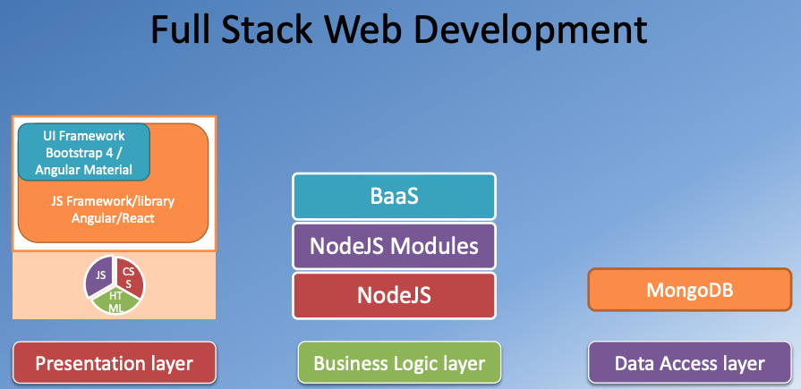
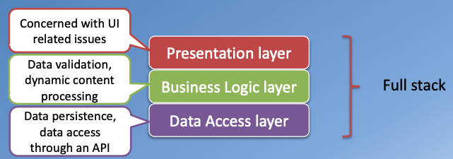
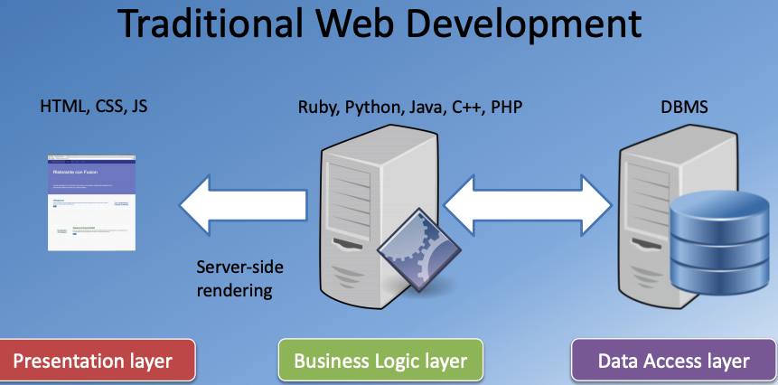
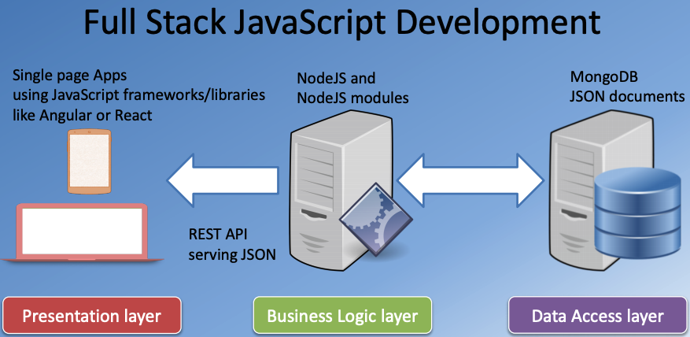

**Full Stack Web Development with React/Angular** @ Prof. Jogesh K. Muppala
 ```Java
@  Note by Puran Zhang
```

# 1. Bootstrap4
Front_end Web UI Frameworks and tools

- Bootstrap [link](https://getbootstrap.com/)
    - Responsive Design and Bootstrap Grid System
    - Bootstrap CSS and JavaScript Components
- Web Tools:
    - Git
    - Node.js and NPM
    - Grunt and Gulp

## 1.1 Overview: Bootstrap
- Full Stack Web Development: The Big Picture
- Setting up your Development Environment: Git and Node
- Introduction to Bootstrap
- Responsive Design and Bootstrap Grid System

**Web design and Development**
- Design
    - User Interface (UI)/ User Experience (UX) Design
    - Visual Design
    - Prototyping
    - Colors, Graphics and Animation
    
- Development, Building and Deployment
    - Web UI Frameworks: Bootstrap 4
    - JavaScript Frameworks/Libraries: Angular/React
    - Hybrid Mobile Frameworks: Ionic, Cordova, NativeScript and React Native
    - Server-side Development: Node + Express + MongoDB
    


**Front end and Back end**
- Front end / Client-side
    - HTML, CSS and Javascript
- Back end / Server-side
    - Various technologies and approaches
    - PHP, Java, ASP.NET, Ruby, Python
    
**Three Tier Architecture**



**Traditional Web Development v.s. Full Stack JavaScript Development**


## 1.2 Bootstrap CSS Components
- Navigation and Navigation Bar
- User Input: Buttons and Forms
- Displaying Content: Tables and Cards
- Images and Media: Images, Thumbnails, Media Objects
- Alerting Users: Tags, Alerts, Progress Bars

## 1.3 Bootstrap Javascript Components
- Bootstrap JavaScript Components Overview
- Tabs, Pills and Tabbed Navigation
- Hide and Seek: Collapse and Accordion
- Revealing Content: Tooltips, Popovers and Modals
- Carousel

## 1.4 Web Tools
- Bootstrap and JQuery
- Less is More!: Less and Sass
- Building and Deployment: NPM Scripts
- Building and Deployment: Task Runners: Grunt and Gulp

# 2. React
Javascript based front-end application development: React library (Currently Ver. 16.3).

- Be familiar with client-side Javascript application development and the React library
- Be able to implement single page applications in React
- Be able to use various React features including components and forms
- Be able to implement a functional front-end web application using React
- Be able to use Reactstrap for designing responsive React applications
- Be able to use Redux to design the architecture for a React-Redux application

## 2.1 Intro. React

In this module we get a quick introduction to front-end JavaScript frameworks and libraries, followed by an introduction to React. We will also learn about React components and JSX.

## 2.2 React Router and Single Page Applications

In this week, you will learn about various component types. You will learn about React router and its use in designing single page applications. You will also learn about single page applications and use React Router to design single page applications.

## 2.3 React Forms, Flow Architecture and Introduction to Redux

In this module you will be introduced to uncontrolled and controlled forms and briefly examine form validation in React applications. You will get an overview of the Flux architecture and introduced to Redux as a way of realizing the flux architecture

## 2.4 More Redux and Client-Server Communication

In this module you will explore Redux further including Redux action, combining reducers, and Redux thunk, client-server communication using Fetch and the REST API. You will get a brief introduction to animation in React. You will also learn about testing, building and deploying React applications.

# 3. Angular
Javascript based front-end framework: the Angular framework (Currently Ver. 6.x).

- Be familiar with client-side Javascript frameworks and the Angular framework
- Be able to implement single page applications in Angular
- Be able to use various Angular features including directives, components and services
- Be able to implement a functional front-end web application using Angular
- Be able to use Angular Material and Angular Flex-Layout for designing responsive Angular applications
- Be able to use Observables and RxJS in the context of Angular applications

## 3.1 Overview: Angular

In this module we get a quick introduction to front-end JavaScript frameworks, followed by an introduction to Angular. We will also learn about Angular components and their templates.

## 3.2 Angular Services, Routing and Single Page Applications

In this week, you learn about data binding in Angular. You will learn how to design basic services. You will learn about Angular router and its use in designing single page applications. You will also learn about single page applications and use Angular Router to design single page applications.

## 3.3 Angular Forms, Angular and Reactive JavaScript

In this module we study Angular support for forms and form validation. Both template-driven forms and reactive forms will be introduced. You will also learn about Promises. Then you will learn briefly about reactive programming, RxJs and its use in Angular.

## 3.4 Client-Server Communication

In this module you will explore client-server communication using both Angular HTTP module and the REST API. You will get a brief introduction to animation support in Angular and create a custom attribute directive. You will also learn about testing, building and deploying Angular applications.

# 4. Server-side Development
NodeJS, Express, MongoDB

- Demonstrate an understanding of server-side concepts, CRUD and REST
- Build and configure a backend server using NodeJS framework
- Build a RESTful API for the front-end to access backend services

## 4.1 Intro. Server-side Development
In this module you will be introduced to Node, Node modules and the Node HTTP server. You will learn about the Express framework and how to set up a REST API using Express.

## 4.2 Database
This module looks in detail at data storage with MongoDB, the popular NoSQL database. You will learn first about Express generator for scaffolding an Express application. Then you will learn about MongoDB. You will learn how to interact with MongoDB from a Node application. Then you will learn the Mongoose ODM to create schemas and models, and interact with MongoDB server

## 4.3 User Authentication
This module is dedicated to user authentication. We first develop a full-fledged REST API server with Express, Mongo and Mongoose. Thereafter we examine basic authentication and session-based authentication briefly. We then develop token-based authentication with the support of JSON web tokens and the Passport module.

## 4.4 Backend as a Service (BaaS)

In this module we learn about Mongoose population, a way of cross-referencing documents and populating the documents from other documents. We then review secure communication using HTTPS. We look at Backend as a Service (BaaS) and take a brief look at Loopba
